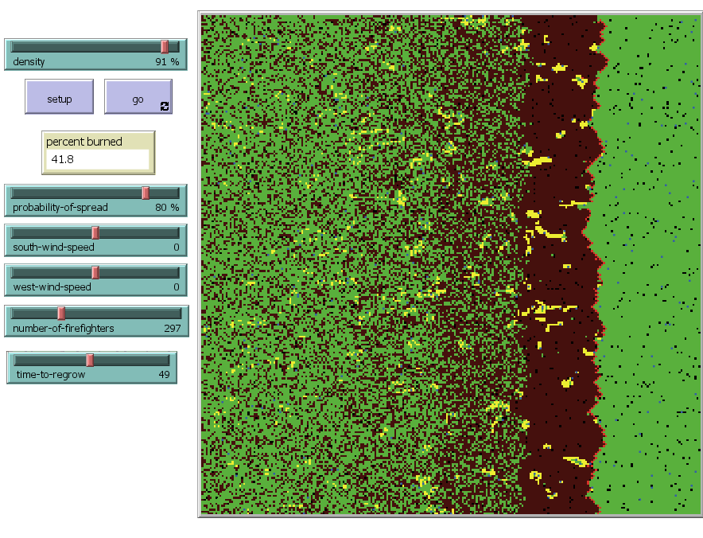
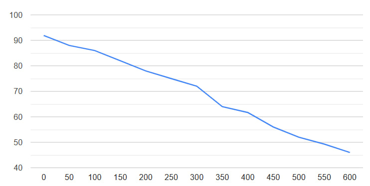

## Комп'ютерні системи імітаційного моделювання
## СПм-23-3, **Ілларіонов Максим Юрійович**
### Лабораторна робота №**2**. Редагування імітаційних моделей у середовищі NetLogo

 

### Варіант 5, модель у середовищі NetLogo:
[Fire Simple Extension 2](http://www.netlogoweb.org/launch#http://www.netlogoweb.org/assets/modelslib/IABM%20Textbook/chapter%203/Fire%20Extensions/Fire%20Simple%20Extension%202.nlogo)

 

### Внесені зміни у вихідну логіку моделі, за варіантом:

**Створення активних агентів** На ігрове поле, яке раніше складалося лише з патчів, були додані активні агенти-пожежники.
<pre>
breed [firefighters firefighter]
</pre>
У процедуру setup було додано код, який розміщує пожежних агентів на вільні місця (патчі, що спочатку не зайняті лісом чи вогнем). Кількість агентів задається користувачем і позначається як number-of-firefighters.
<pre>
  create-firefighters number-of-firefighters [
    let empty-patches patches with [pcolor != green or pcolor != red]
    let random-empty-patch one-of empty-patches
    move-to random-empty-patch
    set color blue  ;;
  ]
</pre>

У процедуру go були внесені зміни, які відповідають за гасіння дерева. На розсуд автора, погашене дерево забарвлюється в жовтий колір для наочності.

<pre>
  ask firefighters [
   if any? neighbors with [pcolor = red] [
     let fire-patch neighbors4 with [pcolor = red]
     set pcolor yellow
     ask fire-patch [set pcolor yellow]
   ]
 ]
</pre>

Також було додано блок, який програмує рух пожежників на одну з доступних для переміщення клітин.

<pre>

    ask firefighters [
    let possible-moves neighbors4 with [member? pcolor [green black]]
    if any? possible-moves [
      move-to one-of possible-moves
    ]
  ]
</pre>

### Зміни, внесені у вихідну логіку моделі на власний розсуд:

**Додано функціональність відновлення лісу**.
Користувач може задати певний час, що визначає кількість тіків, після яких на місці спаленого лісу випадковим чином з'являються нові дерева. Створення нового лісу реалізовано у доданій процедурі.

<pre>
to regrow-trees
  ask n-of (initial-trees - count patches with [pcolor = green]) patches with [pcolor != red] [
    set pcolor green
  ]
end
</pre>

У процедурі go встановлено імітацію таймера, який фактично оперує поточною кількістю тіків.

<pre>
    ;; Check for regrowth of trees
  if ticks mod time-to-regrow = 0 [
    regrow-trees
  ]
</pre>

 

Модель була доповнена двома слайдерами, які регулюють відповідні показники віконня програми. Кінцевий інтерфейс і варіант виконання програми представлені на зображенні:

 

## Обчислювальні експерименти

### 1. Залежність кінцевої кількості згорілого лісу від кількості пожежних

Досліджується залежність кінцевого часу роботи програми від кількості заданих пожежних агентів. Час симуляції визначається кількістю тактів.
Експерименти проводяться при відсоткових значеннях вірогідності від 0 до 600, з кроком 50, усього 13 симуляцій.
Інші керуючі параметри мають значення за замовчуванням:
- **density**: 80
- **south-wind-speed**: 05
- **west-wind-speed**: 0
- **time-to-grow**: 600
- **probability-of-spread**: 75

<table>
<thead>
<tr><th>Кількість пожежних</th> <th>Кінцевий відсоток згорівших дерев</th></tr>
</thead>
<tbody>
<tr><td>0</td><td>91.9</td></tr>
<tr><td>50</td><td>88</td></tr>
<tr><td>100</td><td>86</td></tr>
<tr><td>150</td><td>82</td></tr>
<tr><td>200</td><td>78</td></tr>
<tr><td>250</td><td>75</td></tr>
<tr><td>300</td><td>72</td></tr>
<tr><td>350</td><td>64</td></tr>
<tr><td>400</td><td>61.7</td></tr>
<tr><td>450</td><td>56</td></tr>
<tr><td>500</td><td>52</td></tr>
<tr><td>550</td><td>49.3</td></tr>
<tr><td>600</td><td>46</td></tr>
</tbody>
</table>

 

Графік наочно показує, що кінцева кількість спалених дерев залежить від кількості пожежних. Зі збільшенням кількості пожежних кількість спаленого лісу зменшується рівномірно.